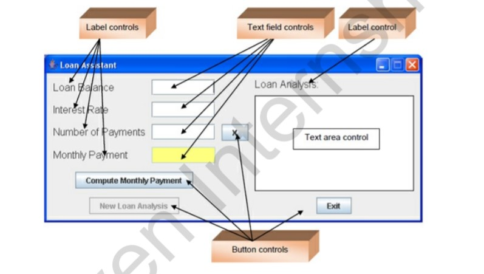
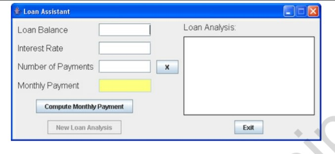
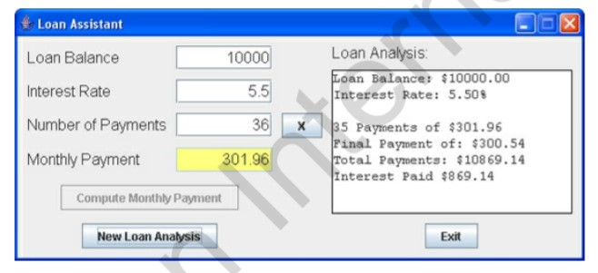
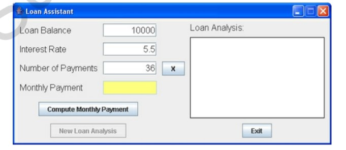
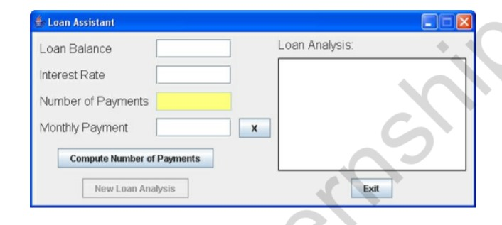
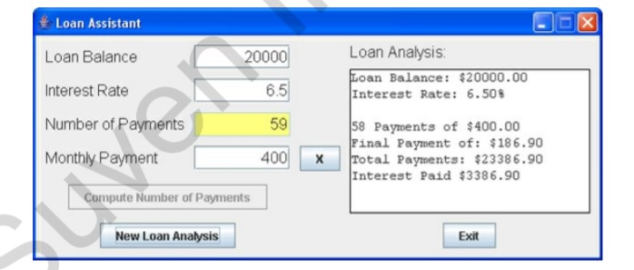

## Getting Started

# Consumer-Loan-Assistant
 (Ever wonder just) How much those credit card accounts are costing you ?
 # Abstract
This project will help you get a handle on consumer debt. The Consumer Loan Assistant Project you would build computes payments and loan terms given balance and interest information. We look at focus traversal among controls, how to do input validation, and the message box for user feedback.
 # overview
In this project, we will build a consumer loan assistant. You input a loan balance and yearly interest
rate. You then have two options: (1) enter the desired number of payments and the loan assistant
computes the monthly payment, or (2) enter the desired monthly payment and the loan assistant
determines the number of payments you will make. An analysis of your loan, including total of
payments and interest paid is also provided.
The finished project is saved as LoanAssistant in the \HomeJava\HomeJava Projects\ project
group. Start NetBeans (or your IDE). Open the specified project group. Make LoanAssistant the
main project. Run the project. You will see:

 

 
All label controls are used for title information. Two button controls are used to compute results
and to start a new analysis. Two small button controls (marked with X; only one is seen at a time)
control whether you compute the number of payments or the payment amount. One button exits the
project. Four text field controls are used for inputs and a large text area is used to present the loan
analysis results.
The loan assistant appears as:
 

 
In this initial configuration, you enter a Loan Balance, an Interest Rate (annual rate as a
percentage) and a Number of Payments value. Click Compute Monthly Payment. The payment
will appear in the ‘yellow’ text field and a complete loan analysis will appear in the large text
field. Here are some numbers I tried:
 

 
So, if I borrow $10,000 at 5.5% interest, I will pay $301.96 for three years (36 months). More
specific details on exact payment amounts, including total interest paid, is shown under Loan
Analysis.
At this point, you can click New Loan Analysis to try some new values:
 

 
Note the Loan Balance, Interest Rate, and Number of Payments entries remain. Only the
Monthly Payment and the Loan Analysis have been cleared. This lets you try different values
with minimal typing of new entries. Change any entry you like to see different results – or even
change them all. Try as many combinations as you like.
At some point, clear the text fields and click the button with an X next to the Number of Payments
text field. You will see:
 

 
Notice the Number of Payments box is now yellow. The button with an X has moved to the
Monthly Payment text field. In this configuration, you enter a Loan Balance, an Interest Rate
and a Monthly Payment. The loan assistant will determine how many payments you need to pay
off the loan. Here are some numbers I tried
 

 
It will take 59 payments (the last one is smaller) to pay off this particular loan. Again, you can
click New Loan Analysis to try other values and see the results.
That’s all you do with the loan assistant project – there’s a lot going on behind the scenes though. The
loan assistant has two modes of operation. It can compute the monthly payment, given the balance,
interest and number of payments. Or, it can compute the number of payments, given the balance,
interest, and payment. The text field representing the computed value is yellow. The button marked X
is used to switch from one mode to the next. To exit the project, click the Exit button.

## Folder Structure

The workspace contains two folders by default, where:

- `src`: the folder to maintain sources
- `lib`: the folder to maintain dependencies

